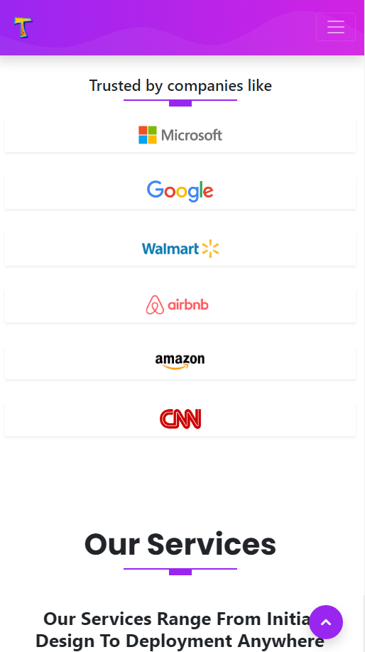
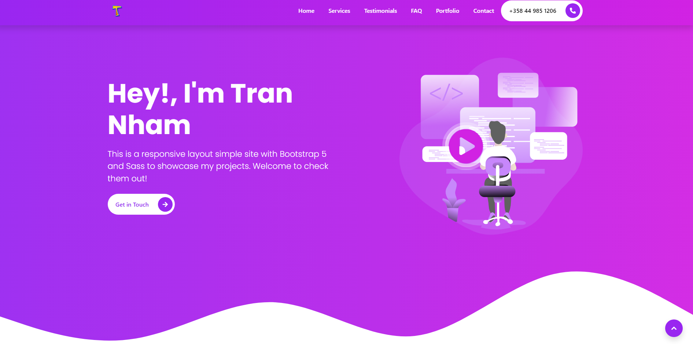

# Portfolio Site - To Show My Recent Projects

## Tech Stacks Being Used In This Simple Site.

```
    Boostrap version 5
    Sass
    Postcss-cli and autoprefixer
    Glightbox

```

<hr />

## Set up npm script to parse sass into css

```
 "compile:sass" : "sass --watch scss:assets/css"
```

<hr />

## Customizing Boostrap

```
_custom.scss/
//import Bootstrap 5

@import '../node_modules/bootstrap/scss';

style.scss/
@use 'custom';

theming-kit.html/
<link rel='stylesheet' href='assets/css/style.css' />

```

## Images and Videos Sources

- www.manypixels.co/gallery
- www.getwaves.io
- www.tableicons.com

## Deploy on Github

Check it out [here](https://trannham.github.io/sass-bootstrap-portfolio/).

## Screenshot



